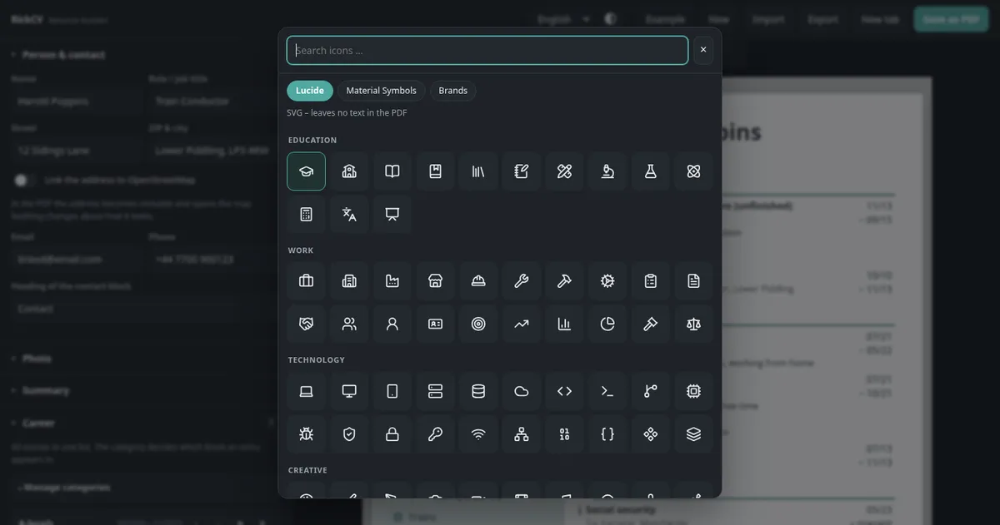
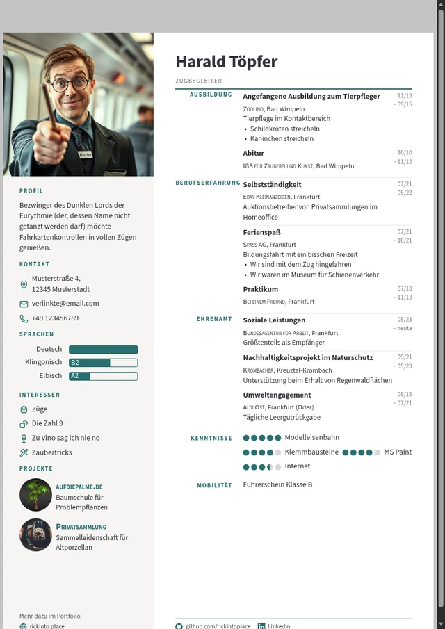

# RickCV - Dynamic Resume & Cover Letter Template
     _____  _      _     _______      __
    |  __ \(_)    | |   / ____\ \    / /
    | |__) |_  ___| | _| |     \ \  / / 
    |  _  /| |/ __| |/ / |      \ \/ /  
    | | \ \| | (__|   <| |____   \  /   
    |_|  \_\_|\___|_|\_\\_____|   \/  [rɪk-si-vi]
    A dynamic template for your resume and cover letter

Build your CV and Cover Letter here: https://cv.rickinto.place/


**RickCV** is a browser-based builder for resumes and cover letters. Fill in a form, watch the
document update live, save it as a PDF. No sign-up, no server, no build step: plain HTML, CSS
and JavaScript, and everything you type stays on your own device — including what you show an
applicant tracking system, which you can read and edit here rather than guess at.

*About the last step in the picture: the import reads what is actually inside the file,
without a language model. A PDF generated from text comes across nearly complete, pictures
included; a scan or a heavily graphic template gives you a rough draft instead. RickCV shows
what it read before it changes anything, and says when the result is only a draft — see
[what a PDF gives away](#what-a-pdf-gives-away).*

## The builder


Edit on the left, watch the document on the right.



Around 150 embedded icons, searchable in German and English.

## Preview

<p align="center">


</p>

The document is laid out onto as many A4 or US Letter sheets as it needs and saved as a PDF
that both people and machines can read. Every theme in the gallery is one CSS file – see
[all nine with pictures](themes/README.md).

## Features

- **Visual editor with live preview:** every part of the document is a form field; the page
  next to it re-renders as you type and shows the page count.
- **Your own categories:** *Education*, *Experience* and *Volunteering* are only the defaults.
  Rename, reorder, add — each keeps a separate machine-readable meaning, so applicant systems
  still file it correctly.
- **Themes are files:** every layout is a single CSS file. Nine come with RickCV; drop in
  someone else's, or write your own **in the builder** — a workshop with the document next to
  it and a download button at the end. No checkout, no build, no reload.
- **Styling down to the detail:** colours, typeface, font size, sidebar width, DIN 5008
  margins, heading sizes for sidebar and main column separately, the space below a heading,
  the alignment of the summary, where a language level sits (in the bar, under it, or not at
  all). A theme brings its own answers; yours overrule them.
- **Real sheets:** the resume is laid out onto as many sheets as it needs. What does not fit
  moves to the next one — whole blocks, never cut in half — and a sheet is added only when
  something has to move. The preview shows what the PDF has, sheet for sheet. Under **Second
  page** you decide what those sheets look like: sidebar or full width, letterhead repeated,
  contact details on every sheet, where the footer belongs.
- **A4 or US Letter:** one setting, and the page box, the print size and the cover letter's
  page breaks all follow.
- **Bring your data in:** drop a file anywhere on the page — a RickCV backup, a
  [JSON Resume](https://jsonresume.org/) `resume.json`, the ZIP from LinkedIn's *Get a copy of
  your data*, an old resume as PDF or `.docx`, or pasted text. RickCV shows what it found
  before anything changes. Reading happens in your browser; no upload.
- **Place and date:** the line German applications carry under the resume, optional and off by
  default. Left empty it fills itself — your city, today's date — so a document opened again
  weeks later never shows a stale date. The cover letter's date works the same way.
- **Honest machine readability:** see exactly what an applicant tracking system reads, and
  edit it yourself. No hidden text — see below.
- **Icon picker:** ~150 embedded [Lucide](https://lucide.dev) icons plus Google Material
  Symbols, searchable in German and English, with one stroke-weight slider driving both sets.
- **Two languages, two editor themes:** German and English for interface and document,
  including the language marking inside the PDF. The editor follows your system's light or
  dark setting; the document stays on white paper, because that is what gets printed.
- **Your data stays yours:** everything lives in your browser. Export it as a RickCV backup,
  as `resume.json`, as a link, or as JSON on the clipboard.

### Icons, sections, timeline and chronology are yours

<p align="center">



</p>

## How to use it

Open <https://cv.rickinto.place/>, fill in the form, click **Save as PDF**. That is the whole
workflow.

Or run it yourself: download the repository and double-click `index.html`. No web server, no
installation, no dependencies, and nothing is fetched at runtime — the typefaces and icons
ship with the project.

```bash
git clone https://github.com/rickintoplace/RickCV.git
```

The editor is a list of sections, in the order they appear on the page: person, photo,
summary, career, the optional blocks (skills, languages, interests, projects, mobility,
references), cover letter, design, themes, machine readability, options. Each block has a
switch to hide it; entries move with ↑ ↓, duplicate with ⧉ and go with ✕. Under *Manage
categories* you rename or add career categories — a category called "My journey" still
exports as professional experience, because its machine-readable meaning is set separately.

### Saving as PDF

Click **Save as PDF**. In the browser's print dialog choose:

| Setting | Value |
| --- | --- |
| Destination | Save as PDF |
| Paper size | A4 |
| Margins | None |
| Background graphics | Enabled |

Chromium-based browsers give the most predictable result, since the layout is tuned for them.
Firefox now produces a usable PDF as well, with every piece of text still text.

### Keeping and moving your data

Your document is saved in your browser automatically, so you can close the tab and come back
later. Because the browser storage is tied to one browser on one device, use **Export** to
download a `.json` backup and **Import** to load it again on another computer, in another
browser, or to keep several versions of your CV side by side.

## About ATS and hidden text

RickCV used to embed a copy of your data behind the layout, so that applicant tracking systems
would pick it up. **That is no longer the default.** Detectors now treat invisible content as
a manipulation attempt: text below 4 pt, text in the background colour, any mismatch between
*what a human sees* and *what a machine extracts*. In a measurement study of 196,682 real
resumes, roughly 1 % carried hidden injected content — over 90 % of it plain hidden skill and
experience lists.

What actually helps is duller:

- **Chromium exports a tagged PDF.** The file carries a structure tree and a language marking,
  so the reading order follows the DOM. RickCV puts your name and contact details before the
  career blocks for that reason.
- **The icon set matters.** Material Symbols is a font, so the icon name ends up glued to your
  heading in the extracted text (`schoolEDUCATION`). Lucide icons are SVG and leave nothing
  behind — which is why they are the default.
- **The document title becomes the PDF title** and the suggested filename.

If your layout is unusually graphic and you still want a safety net, **Machine readability**
offers a *visible* extra page in plain text: read it, copy it, or write it yourself. The
invisible mode is still there, clearly marked, for people who want it anyway.

On **GEO (Generative Engine Optimization)**: a 2026 survey of 45 studies finds no reviewed
technique with a stable, cross-platform causal effect. Nothing worth building into a resume,
so RickCV does not pretend otherwise.

Sources: [Measuring Real-World Prompt Injection Attacks in LLM-based Resume
Screening](https://arxiv.org/abs/2605.28999) ·
[Optimizing Visibility in Generative Engines: A Critical Survey
(2023–2026)](https://arxiv.org/abs/2607.14035) ·
[PhantomLint](https://arxiv.org/abs/2508.17884) ·
[W3C: reading order in PDF](https://www.w3.org/WAI/WCAG22/Techniques/pdf/PDF3)

## A note on browsers

Editing works in any modern browser, and so does the PDF export. The layout is tuned for
Chromium, which handles margins, page breaks and background colors most predictably. The
preview bar says so when you are somewhere else. Firefox produces a usable PDF too, and every
piece of text in it is still text. That is manages through static font weights instead of a
variable font, which Firefox's PDF engine used to synthesise into bold.

## Themes

A theme is one CSS file. Nine come with RickCV —
[see them with pictures](themes/README.md):

| Theme | |
| --- | --- |
| **Clean** | the calm baseline: timeline at the edge, dates on the right |
| **Dynaline** | the timeline as an axis; how long something lasted sets the distance |
| **Icons** | symbols carry the layout, timeline down the middle |
| **Classic** | serifs, small caps and hairlines, stations as a list with hanging dates |
| **Compact** | the date moves onto the title's line; a career that needs two sheets elsewhere fits on one |
| **Terminal** | monospaced, square, dark sidebar, stations against a gutter rule |
| **Right Rail** | the sidebar moves to the right and loses its fill; the career starts at the left edge |
| **Margin Heads** | section headings sit in the margin beside their section, not above it |
| **Banner** | a coloured band carries the name across the main column, skills sit in pills |

The same mechanism takes any other file: drop a `.css` anywhere on the builder, or pick one in
**Themes**.

A theme may bring its own palette, and most do. The colours you change in **Design** still win:
a colour you touch is written onto the document itself and overrules the theme, while everything
you leave alone stays the theme's business. One button hands the whole palette back.

### Writing one without cloning anything

Open the builder, go to **Themes → Workshop**, and start from the current theme or an empty
skeleton. What you type lands in the document on the right immediately; a list of every hook
and variable sits below the editor and drops selectors in at the cursor. **Save as .css**, and
that file *is* the theme — drop it back onto the builder any time, on any machine, to use it.
Nothing else is needed: no clone, no Python, no build.

To put it in the gallery, press **Contribute**. That opens GitHub's new-file form with your
CSS already in it, so a contribution is one click and a pull request. The maintainer runs
`build-themes.py` and `make-theme-previews.py` once; the preview image is rendered from the
example document, never from anyone's data.

That path exists on purpose: a theme system that starts with "clone the repository, run a
server, edit a file, reload" has no contributors.

### What a theme can rely on

The renderer's markup is a documented, versioned contract, see
[`themes/CONTRACT.md`](themes/CONTRACT.md). Blocks carry `data-block`, columns carry
`data-column`, career sections carry their machine-readable `data-role`, stations carry
`data-date-mode`, and the CSS variables at the top of `styles.css` are the styling API. A test
renders the example document and insists on every one of those hooks, so renaming a class
fails the build instead of quietly breaking other people's themes.

Themes are applied in the **`theme` cascade layer** and the base styles live in `base`, which
means a theme rule wins regardless of specificity. No `!important`, no need to out-specify
the stylesheet. The exception is deliberate: `!important` rules in the base layer still win,
which is what keeps a theme from breaking the icon font.

Two things are removed from a theme when it is loaded: `@import` and remote `url()` (a resume
should not report home when someone opens it, embed images and fonts as `data:` URIs), and
any rule aimed at the plain-text layer (`.ats-…`), because what an applicant tracking system
reads is not a question of looks. The builder says when it removed something.

```bash
python3 tools/build-themes.py          # themes/*.css → js/theme-data.js
python3 tools/make-theme-previews.py   # gallery images for themes/README.md
node tests/theme.test.mjs              # contract + every theme in themes/
```

The bundle exists because a page opened over `file://` may not fetch files, and RickCV has to
work by double-clicking `index.html`. Like `js/icon-data.js`, the generated file is committed.

## When an AI writes the application

People increasingly hand their notes to a language model and ask for the finished
application. RickCV is built to be the tool that model reaches for, and
[`AGENTS.md`](AGENTS.md) — mirrored as [`llms.txt`](llms.txt) — says exactly how:

The agent builds a JSON document, encodes it `base64url`, and hands the person a link:

```
https://cv.rickinto.place/#data=<token>&print=1
```

One click opens the builder with the document in it, through the same confirmation step as
any other import, showing what is about to arrive, so nothing is written behind the person's
back. Nothing is fetched over the network either: the data travels inside the link. A resume
without a photo makes a link of one to three kilobytes.

What an agent cannot do is produce the PDF: that happens in the person's browser, one click
on **Save as PDF**. The documentation says so rather than pretending otherwise, and it
also says what not to do: no invisible keywords, no invented stations, `"rank": 0` when a
skill level is unknown. The example document in `AGENTS.md` is imported by the test suite on
every run, so the instructions cannot rot.

## Bringing your data in

The **Import** button (or dropping a file anywhere on
the page) opens one dialog that takes whatever you have:

| What you have | What to do |
| --- | --- |
| A RickCV backup (`*.rickcv.json`) | Drop it in. Everything comes back, styling included. |
| A `resume.json` ([JSON Resume](https://jsonresume.org/schema)) | Drop it in. Work, education, volunteering, awards, certificates, skills, languages, interests, projects and references are mapped onto RickCV's sections. |
| An export from [Reactive Resume](https://rxresu.me/) | Drop it in. Its own JSON is read directly, the current shape and v4: periods written as free text (`March 2022 - Present`), HTML descriptions turned back into paragraphs and bullets, and its 0–5 skill levels kept as they are. Hidden items stay hidden. |
| Your LinkedIn data | *Settings → Data privacy → Get a copy of your data*. Drop the ZIP in — or the single CSV files, if your browser cannot unpack ZIPs. |
| A Word file (`.docx`) | Drop it in. This is the best route of all, see below. The old `.doc` format is not readable — save it as `.docx` in Word first. |
| An old resume as PDF | Drop it in. RickCV pulls the text out, separates columns, sorts it into sections and takes the pictures with it. Scanned PDFs hold no text, so those cannot work. |
| Anything else | Copy the text into the dialog's text box. |

Whatever the source, the dialog first shows **what it found** — name, number of stations,
skills, languages — and lets you decide between *Ersetzen* (a new document, keeping your
styling) and *Ergänzen* (append to what is already there, fill empty fields). Nothing is
changed until you confirm.

Text and PDF imports are a **draft**: a PDF knows about coordinates, not about careers, so
the guesses are labelled as such and want checking. The structured formats — RickCV, JSON
Resume, LinkedIn — are exact.

### Word documents

If your resume still exists as a `.docx`, use that rather than a PDF. A Word file is a ZIP
with XML inside, and that XML *states* what a PDF only implies: this paragraph is a heading,
this is a table cell, this is a bullet, this image belongs here. RickCV reads it directly —
headings from Word's own styles, table rows as label-and-value pairs, line breaks inside a
cell as separate lines (which is where templates hide the difference between employer, role
and degree), and the pictures out of `word/media`.

No converter, no upload: the same ZIP reader that opens a LinkedIn export opens the `.docx`,
and the XML is read in the browser.

### What a PDF gives away

A PDF holds no sections, no headings and no dates — only characters at coordinates. RickCV
puts the document back together from what *is* there:

- **Columns** are found by the widest vertical lane no line of text crosses, so a sidebar is
  read as a sidebar and not woven into the main column.
- **Headings** are recognised by keyword, with letter-spaced titles (`B E R U F S -
  E R F A H R U N G`) closed up first. Unknown headings are measured against the recognised
  ones — same size, same spacing — so a section ends where it really ends.
- **The name** is the largest type on the sheet, not the first line; where a narrow column
  breaks it across two lines, the two are put back together.
- **Dates** are read wherever they sit: in front of the entry, at the end of the line, split
  over two lines, with two-digit years, German or English month names, and an open end
  (`heute`, `present`).
- **Two-column lists** are understood, the shape most German templates use:
  `Sprachkenntnisse   Deutsch, Muttersprache` puts its content where the label says, `Go
  ●●●●○` becomes a skill with four dots out of five, and `Führerschein   Klasse B` lands in
  mobility. Where a label carries no meaning it is kept, because the same gap can equally
  separate two skills set side by side.
- **Employer before role** is handled: `Nordwind Energie GmbH, Kassel` followed by
  `Projektleiterin Netzausbau` is read as company, place and title — not the other way round.
- **Pictures** are placed by where they sit: the large upright one at the top becomes the
  photo, a flat wide one on a letter page the signature, a small one beside a project that
  project's picture. What cannot be placed is left out rather than dropped somewhere random.
- **Icon fonts** contribute no text. They are recognised by the name of the embedded font,
  which is more reliable than looking at the characters — depending on the file an icon
  arrives as a private-use character, an empty piece, or its spelled-out name (`school`).
- **The cover letter** stops the reading: from the salutation on, nothing is treated as part
  of the resume. So does the closing line of a German resume (`Beispielstadt, 16.09.2026`).
- **When a PDF has no text for its headings** — bold type drawn as graphics, which is what
  Firefox does with variable fonts — RickCV says so and still salvages dates, employers,
  places and descriptions as stations under one category.

Unreadable characters are dropped rather than passed through, and the import says so. Where
little is recognised, it shows you the text it read, so you can sort it in by hand instead of
hunting for what went missing.

### Going the other way

*Export* offers four doors. Two of them produce a file: the complete RickCV backup, and `resume.json` in
the JSON Resume format, which other resume tools, themes and CLI renderers can read. Your
career data is yours to take elsewhere. The two differ on purpose: the backup holds
everything, the `resume.json` holds what the document actually shows — a section switched
off is not part of your resume.

The other two copy to the clipboard: **the whole document as a link** (the same
`#data=` address an agent would build, so you can carry on at another machine or send someone
your state), and **the raw JSON**, for when a link would be unwieldy — a photo makes it long.

None of this involves a server. Files are read in the browser, including the PDF: pdf.js
lives in `vendor/` and is loaded from your own copy of the site.

## Hosting it yourself

RickCV is a static site. Upload the files and you are done.

Copy the folder onto any static host — there is nothing to build and nothing to configure.
The public instance at <https://cv.rickinto.place/> runs on Vercel; GitHub Pages, a shared web
space or a directory served by nginx work exactly the same.

## Project structure

| Path | Purpose |
| --- | --- |
| `index.html` | The builder – the page visitors open |
| `cv.html` | The document itself, shown in the preview frame and printed |
| `builder.css` | Styling of the editor |
| `styles.css` | Styling of the resume and cover letter |
| `js/i18n.js` | German and English texts |
| `js/model.js` | Data model, example data, migration of older saves |
| `js/render.js` | Turns the data into the resume and cover letter |
| `js/ats.js` | Builds the plain-text version |
| `js/icons.js`, `js/icon-data.js`, `js/icon-picker.js` | Icon catalogue and picker |
| `js/fields.js` | Reusable form controls |
| `js/sections.js` | What each editor section contains |
| `js/builder.js` | Wiring: state, history, saving, preview, printing |
| `js/import.js` | Reading and writing other formats: JSON Resume, LinkedIn, CSV, text |
| `js/import-dialog.js` | The dialog behind *Import* |
| `js/pdf-import.js` | Text and picture extraction from PDFs, loads `vendor/pdfjs` on demand |
| `js/docx-import.js` | Reads Word documents: ZIP, XML, tables, pictures |
| `js/themes.js` | Themes: header, safety checks, hook catalogue |
| `js/theme-data.js` | The shipped themes, generated by `tools/build-themes.py` |
| `themes/` | One CSS file per theme, plus `CONTRACT.md` and `_starter.css` |
| `vendor/pdfjs/` | Mozilla's pdf.js (Apache-2.0), only fetched when a PDF is imported |
| `tools/gen-icons.py` | Regenerates `js/icon-data.js` from lucide-static |

Every file is a plain script which is what lets you
open `index.html` by double-clicking it.

## Fonts, icons, and why they are files

Everything in **Design** writes to CSS variables at the top of `styles.css`; if you want to go
further than the editor allows, that is the place to look.

Nothing is fetched at runtime. All nine document typefaces live in `fonts/`, as does a
Material Symbols icon font cut down to the symbols the builder actually offers (53 kB instead
of 2.3 MB); [Lucide](https://lucide.dev) icons are embedded in `js/icon-data.js`. So the
builder works offline and no visitor's IP address reaches a third party. `tools/fetch-fonts.py`
refreshes the files and pulls in the licence texts, `tools/gen-icons.py` the icon selection.

Each typeface ships as **two static files, 400 and 700**, not as one variable font. That is
about machine readability: with a variable font the browser derives the bold weight itself,
and some print paths cannot express that in a PDF. Firefox, through cairo, draws such text as
vector outlines — the page looks right, but the bold parts are no longer text. In a resume
that is the name, every section heading and every job title. For the same reason the document
switches **ligatures off**: printed through cairo, a single "fl" glyph arrives without a
mapping and `Tierpflege` reaches the reader as `Tierp?ege`. The icon font is exempt — it
builds its symbols out of ligatures.

## Contributing

Fork it, change it, open a pull request. There is no build step and nothing to install: open
`index.html` and you are developing. The easiest contribution is a theme — one CSS file, and
the **workshop** inside the builder writes it for you.

Two test suites, because parsing other people's files is where silent breakage lives:

```bash
node tests/import.test.mjs   # Node only; the browser code runs in a vm sandbox
node tests/theme.test.mjs    # plus a headless Chromium for the DOM contract
```

Fixtures live in `tests/fixtures/`: a JSON Resume, a plain-text resume, a LinkedIn ZIP, a
Word file and several PDFs. If you add a format or touch the heuristics, add a fixture.

## License

RickCV is free software under the **GNU Affero General Public License, version 3 or
later** (AGPL-3.0-or-later). The full text is in [`LICENSE`](LICENSE).

In plain words: use it, run it, change it, host it — for yourself, inside a company, or as
a public service. The one condition is that anyone who uses your version, **including over
a network**, can get its source code. That is section 13 of the licence, and it is the
reason this project picked the AGPL over the MIT licence: it keeps a hosted fork open
instead of closed behind a paywall.

Third-party components keep their own licences: [Lucide](https://lucide.dev) icons (ISC),
the document typefaces (SIL Open Font Licence) and Material Symbols (Apache-2.0) in
[`licenses/`](licenses/), and, for the optional PDF import, Mozilla's
[pdf.js](https://mozilla.github.io/pdf.js/) (Apache-2.0) in `vendor/`.


