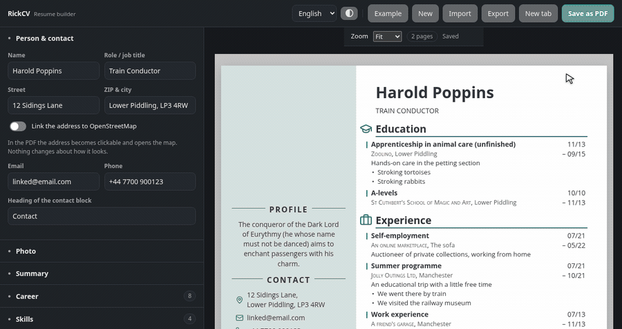
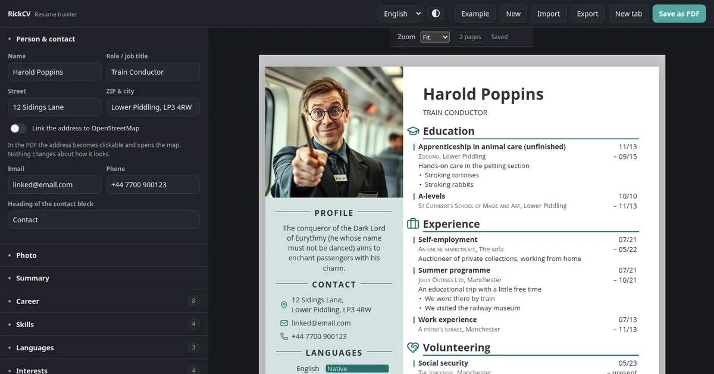
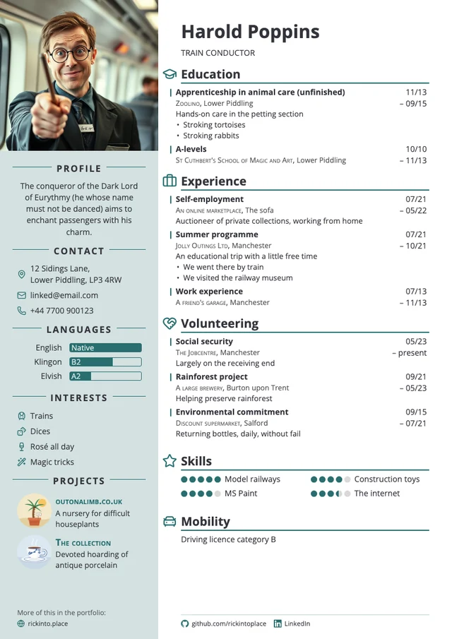
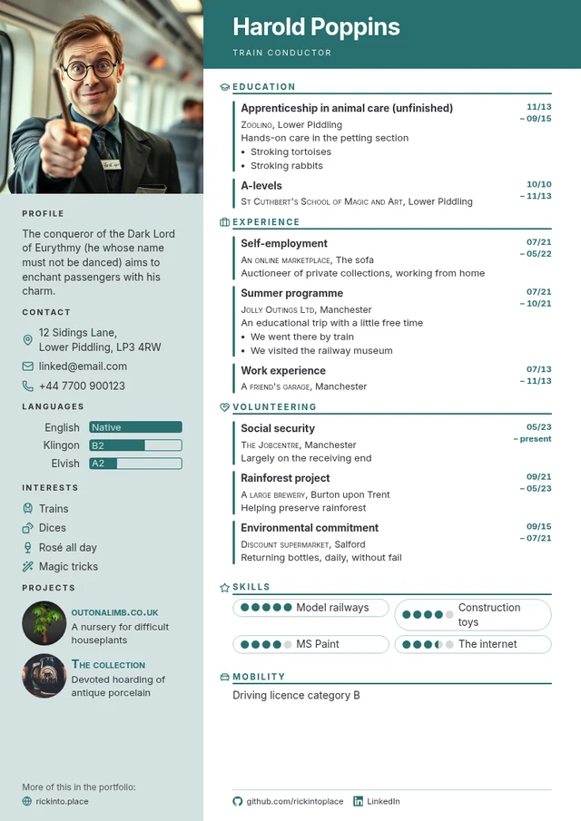
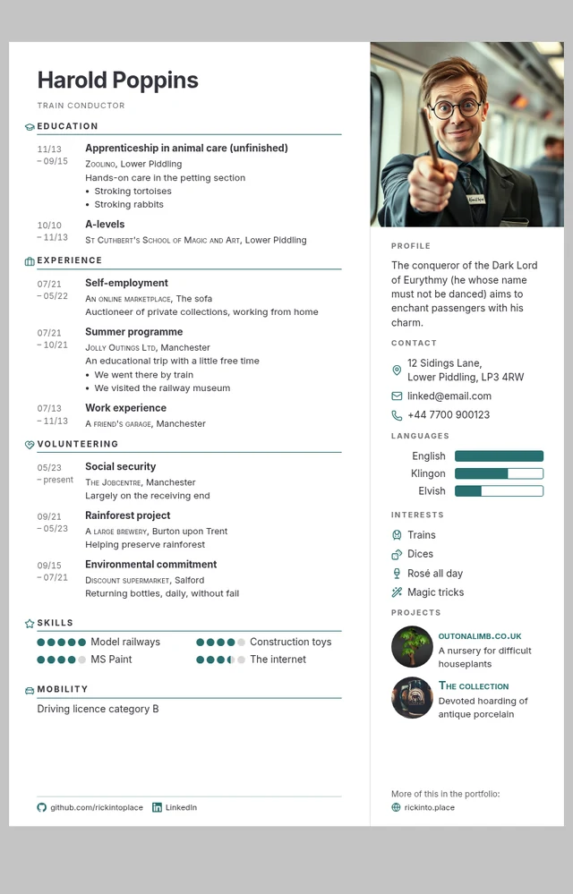

# RickCV - Dynamic Resume & Cover Letter Template
     _____  _      _     _______      __
    |  __ \(_)    | |   / ____\ \    / /
    | |__) |_  ___| | _| |     \ \  / / 
    |  _  /| |/ __| |/ / |      \ \/ /  
    | | \ \| | (__|   <| |____   \  /   
    |_|  \_\_|\___|_|\_\\_____|   \/  [rɪk-si-vi]
    A dynamic template for your resume and cover letter

Build your CV and Cover Letter here: https://cv.rickinto.place/



**RickCV** is a browser-based builder for resumes and cover letters. Fill in a form, watch the
document update live, save it as a PDF. No sign-up, no server, no build step: plain HTML, CSS
and JavaScript, and everything you type stays on your own device — including what you show an
applicant tracking system, which you can read and edit here rather than guess at.

*About the last step in the picture: the import reads what is actually inside the file,
without a language model. A PDF generated from text comes across nearly complete, pictures
included; a scan or a heavily graphic template gives you a rough draft instead. RickCV shows
what it read before it changes anything, and says when the result is only a draft — see
[what a PDF gives away](#what-a-pdf-gives-away).*

## The builder



Edit on the left, watch the document on the right — around 150 embedded icons, searchable in
German and English.

<p align="center">



</p>

The document is laid out onto as many A4 or US Letter sheets as it needs and saved as a PDF
that both people and machines can read. Every theme is one CSS file — see
[all nine with pictures](themes/README.md).

## Features

- **Visual editor with live preview** — every part of the document is a form field; the page
  next to it re-renders as you type.
- **Your own categories** — *Education*, *Experience* and *Volunteering* are only defaults.
  Rename, reorder, add; each keeps a machine-readable meaning, so applicant systems still file
  it correctly.
- **Themes are files** — nine come with RickCV, and you can write your own **in the builder**,
  with the document next to it and a download button at the end. No checkout, no build.
- **Styling down to the detail** — colours, typeface, font size, sidebar width, DIN 5008
  margins, heading sizes per column, the space below a heading, the alignment of the summary,
  where a language level sits. A theme brings its own answers; yours overrule them.
- **Real sheets** — the resume flows onto as many as it needs: whole blocks move, never cut in
  half, and only when they have to. The preview shows what the PDF has, sheet for sheet. Under
  *Second page* you say what follow-up sheets carry.
- **A4 or US Letter** — one setting; page box, print size and the cover letter's breaks follow.
- **Place and date** — the line German applications carry under the resume, optional. Left
  empty it fills itself: your city, today's date.
- **Bring your data in** — drop a file anywhere on the page: a RickCV backup, a
  [JSON Resume](https://jsonresume.org/), a LinkedIn export, an old resume as PDF or `.docx`,
  or pasted text. A cover letter in the same file comes along too, whether it sits before the
  resume or after it. Read in your browser; no upload.
- **Let your AI write it** — RickCV has no model built in, but if you use one, it hands you a
  ready-made brief to copy: for a chat in the browser the complete data format, for an agent
  a pointer to [AGENTS.md](AGENTS.md). The chat's answer goes back in through the same
  confirmation as any import.
- **Honest machine readability** — see exactly what an applicant system reads, and edit it. No
  hidden text; see below.
- **Two languages** — German and English for interface and document, including the language
  marking inside the PDF. The editor follows your system's light or dark setting.
- **Your data stays yours** — everything lives in your browser. Save it as a backup, as
  `resume.json`, as a link, or as JSON on the clipboard.

## How to use it

Open <https://cv.rickinto.place/>, fill in the form, click **Save as PDF**. That is the whole
workflow.

Or run it yourself: download the repository and double-click `index.html`. No web server, no
installation, no dependencies, and nothing is fetched at runtime — the typefaces and icons
ship with the project.

```bash
git clone https://github.com/rickintoplace/RickCV.git
```

The editor has four tabs: **Resume** (person, photo, summary, career and the optional
blocks — skills, languages, interests, projects, mobility, references, links), **Cover
letter**, **Design** (themes, colours, type, spacing) and **Settings** (page size, pages,
language, machine readability). Opening *Cover letter* scrolls the preview to the letter. A
section whose block is switched off says *hidden* in its heading, so you see it without opening
it. Entries can be duplicated and removed — a removal comes with an *Undo* — and moved where
their order is yours to choose; career entries sort themselves by date, as on the page. Under
*Manage categories* you rename or add career categories — a category called "My journey" still
exports as professional experience, because its machine-readable meaning is set separately.

Everything works from the keyboard: the tabs with the arrow keys, menus with arrows and
Escape, dialogs keep the focus until they close, and the divider between form and preview
moves with the arrow keys too.

### Saving as PDF

Click **Save as PDF**. The first time, RickCV says what to set before the browser's print
dialog opens (you can switch that off):

| Setting | Value |
| --- | --- |
| Destination | Save as PDF |
| Paper size | A4 |
| Margins | None |
| Background graphics | Enabled |

Editing works in any modern browser, and so does the export. The layout is tuned for Chromium,
which handles margins, page breaks and background colours most predictably — the preview bar
says so when you are somewhere else. Firefox produces a usable PDF too, and every piece of text
in it is still text; that was not always so, and the fix was to ship static font weights
instead of a variable font, which Firefox's PDF engine used to synthesise into bold.

Your document is saved in the browser as you type. That storage belongs to one browser on one
device, so use **Export** for a `.json` backup and **Import** to open it elsewhere — or to keep
several versions side by side. Anything that swaps the whole document — *Example*, *New* (both
in the **…** menu), an import — can be taken back: the notice that follows carries an *Undo*,
and so do the arrows in the header (Ctrl+Z, and Ctrl+Shift+Z to redo). *Example* and *New* ask
first whenever there is something of yours to lose, because *Undo* only lasts as long as the tab
stays open.

## About ATS and hidden text

RickCV used to embed a copy of your data behind the layout so applicant tracking systems would
pick it up. **That is no longer the default.** Detectors treat invisible content as
manipulation: text below 4 pt, text in the background colour, any mismatch between what a human
sees and what a machine extracts. In a study of 196,682 real resumes, roughly 1 % carried
hidden injected content — over 90 % of it plain hidden skill lists.

What actually helps is duller: Chromium exports a **tagged PDF**, so the reading order follows
the DOM, and RickCV puts your name and contact details before the career blocks. The **icon
set** matters too — Material Symbols is a font, so the icon name is glued to your heading in
the extracted text (`schoolEDUCATION`); Lucide icons are SVG and leave nothing behind, which is
why they are the default. And the document title becomes the PDF title and the filename.

If your layout is unusually graphic and you still want a safety net, **Machine readability**
offers a *visible* extra page in plain text: read it, copy it, or write it yourself. The
invisible mode is still there, clearly marked, for people who want it anyway.

On **GEO (Generative Engine Optimization)**: a 2026 survey of 45 studies finds no technique
with a stable, cross-platform causal effect. Nothing worth building into a resume.

Sources: [Measuring Real-World Prompt Injection Attacks in LLM-based Resume
Screening](https://arxiv.org/abs/2605.28999) ·
[Optimizing Visibility in Generative Engines: A Critical Survey
(2023–2026)](https://arxiv.org/abs/2607.14035) ·
[PhantomLint](https://arxiv.org/abs/2508.17884) ·
[W3C: reading order in PDF](https://www.w3.org/WAI/WCAG22/Techniques/pdf/PDF3)

## Themes

A theme is one CSS file. Nine come with RickCV —
[see them with pictures](themes/README.md):

| Theme | |
| --- | --- |
| **Clean** | the calm baseline: timeline at the edge, dates on the right |
| **Dynaline** | the timeline as an axis; how long something lasted sets the distance |
| **Icons** | symbols carry the layout, timeline down the middle |
| **Classic** | serifs, small caps and hairlines, stations as a list with hanging dates |
| **Compact** | the date moves onto the title's line; a career that needs two sheets elsewhere fits on one |
| **Terminal** | monospaced, square, dark sidebar, stations against a gutter rule |
| **Right Rail** | the sidebar moves to the right and loses its fill; the career starts at the left edge |
| **Margin Heads** | section headings sit in the margin beside their section, not above it |
| **Banner** | a coloured band carries the name across the main column, skills sit in pills |

The same mechanism takes any other file: drop a `.css` anywhere on the builder, or pick one in
**Themes**.

A theme may bring its own palette, and most do. The colours you change in **Design** still win:
a colour you touch is written onto the document itself and overrules the theme, while everything
you leave alone stays the theme's business. One button hands the whole palette back.

### Writing one without cloning anything

Open the builder, go to **Themes → Workshop**, and start from the current theme or an empty
skeleton. What you type lands in the document on the right immediately; a list of every hook
and variable sits below the editor and drops selectors in at the cursor. **Save as .css**, and
that file *is* the theme — drop it back onto the builder any time, on any machine, to use it.
Nothing else is needed: no clone, no Python, no build.

To put it in the gallery, press **Contribute**. That opens GitHub's new-file form with your
CSS already in it, so a contribution is one click and a pull request. The maintainer runs
`build-themes.py` and `make-theme-previews.py` once; the preview image is rendered from the
example document, never from anyone's data.

That path exists on purpose: a theme system that starts with "clone the repository, run a
server, edit a file, reload" has no contributors.

### What a theme can rely on

The renderer's markup is a documented, versioned contract —
[`themes/CONTRACT.md`](themes/CONTRACT.md). Blocks carry `data-block`, columns `data-column`,
career sections their machine-readable `data-role`, stations `data-date-mode`, and the CSS
variables at the top of `styles.css` are the styling API. A test insists on every one of those
hooks, so renaming a class fails the build instead of quietly breaking other people's themes.

Themes are applied in the **`theme` cascade layer**, the base styles in `base` — a theme rule
wins regardless of specificity, without `!important`. Two things are stripped on load:
`@import` and remote `url()` (a resume should not report home; embed images as `data:` URIs),
and any rule aimed at the plain-text layer (`.ats-…`). The builder says when it removed
something.

```bash
python3 tools/build-themes.py          # themes/*.css → js/theme-data.js
python3 tools/make-theme-previews.py   # gallery images for themes/README.md
node tests/theme.test.mjs              # contract + every theme in themes/
```

The bundle exists because a page opened over `file://` may not fetch files, and RickCV has to
work by double-clicking `index.html`. Like `js/icon-data.js`, it is committed.

## When an AI writes the application

People hand their notes to a language model and ask for the finished application. RickCV is
built to be the tool that model reaches for, and [`AGENTS.md`](AGENTS.md) — mirrored as
[`llms.txt`](llms.txt) — says how: the agent builds a JSON document, encodes it `base64url`
and hands the person a link.

```
https://cv.rickinto.place/#data=<token>&print=1
```

One click opens the builder with the document in it, through the same confirmation step as any
other import — nothing is written behind the person's back, and nothing is fetched over the
network: the data travels inside the link (one to three kilobytes without a photo). The
confirmation also says what else the document brings: its own theme, or the invisible ATS
text, which an import switches off rather than on.

What an agent cannot do is produce the PDF; that happens in the person's browser. The
documentation says so rather than pretending otherwise, and it says what not to do: no
invisible keywords, no invented stations, `"rank": 0` when a skill level is unknown. Its
example document is imported by the test suite on every run, so the instructions cannot rot.

## Bringing your data in

Drop the file anywhere on the page — over the editor, over the preview, over a field. There is
an **Import** button too, but a resume dragged onto RickCV has said what it is for. Either way
the same dialog opens and takes whatever you have:

| What you have | What to do |
| --- | --- |
| A RickCV backup (`*.rickcv.json`) | Drop it in. Everything comes back, styling included. |
| A `resume.json` ([JSON Resume](https://jsonresume.org/schema)) | Drop it in. Work, education, volunteering, awards, certificates, skills, languages, interests, projects and references are mapped onto RickCV's sections. |
| An export from [Reactive Resume](https://rxresu.me/) | Drop it in. Its own JSON is read directly, the current shape and v4: periods written as free text (`March 2022 - Present`), HTML descriptions turned back into paragraphs and bullets, and its 0–5 skill levels kept as they are. Hidden items stay hidden. |
| Your LinkedIn data | *Settings → Data privacy → Get a copy of your data*. Drop the ZIP in — or the single CSV files, if your browser cannot unpack ZIPs. |
| A Word file (`.docx`) | Drop it in. This is the best route of all, see below. The old `.doc` format is not readable — save it as `.docx` in Word first. |
| An old resume as PDF | Drop it in. RickCV pulls the text out, separates columns, sorts it into sections and takes the pictures with it. Scanned PDFs hold no text, so those cannot work. |
| Anything else | Copy the text into the dialog's text box. |

Whatever the source, the dialog first shows **what it found** — name, stations, skills,
languages — and lets you choose *Replace* (a new document, your styling and theme stay) or
*Add to it* (append, fill empty fields). Nothing changes until you confirm.

Text and PDF imports are a **draft** and say so; the structured formats — RickCV, JSON Resume,
Reactive Resume, LinkedIn, Word — are exact.

### Word documents

If your resume still exists as a `.docx`, use that rather than a PDF. A Word file is a ZIP with
XML inside, and that XML *states* what a PDF only implies: this paragraph is a heading, this is
a table cell, this is a bullet, this picture belongs here. RickCV reads it directly — Word's own
heading styles, table rows as label-and-value pairs, line breaks inside a cell as separate
lines, and the pictures out of `word/media`. No converter, no upload: the same ZIP reader that
opens a LinkedIn export opens the `.docx`.

Downloadable templates rarely use paragraphs, though. They scatter two dozen text boxes across
the sheet, each with a position in twenty-thousandths of an inch, stored in the order someone
drew them — and each one twice, because Word writes a second copy for versions older than 2007.
Read from front to back, that gives you the name between two bullet points. So RickCV measures
instead: the stand-in copies are dropped, every line gets its place on the sheet, and the same
code that turns a PDF into lines turns those places into lines — columns, tabs and all.
Characters from symbol fonts (Wingdings and its relatives) are left out the way icon fonts are
left out of a PDF: they are pictures, not letters.

### What a PDF gives away

A PDF holds no sections, no headings and no dates — only characters at coordinates. RickCV puts
the document back together from what *is* there:

- **Columns** by the widest vertical lane no line of text crosses, so a sidebar is read as a
  sidebar and not woven into the main column.
- **Headings** by keyword, with letter-spaced titles (`B E R U F S E R F A H R U N G`) closed
  up first; unknown ones are measured against the recognised headings of that very document.
- **The name** is the largest type on the sheet, not the first line — and is put back together
  where a narrow column broke it across two lines.
- **Dates** wherever they sit: before the entry, at the end of the line, split over two lines,
  two-digit years, German or English month names, an open end (`heute`, `present`).
- **Two-column lists**, the shape most German templates use: `Sprachkenntnisse   Deutsch,
  Muttersprache` goes where the label says, `Go   ●●●●○` becomes a skill with four dots out of
  five, `Führerschein   Klasse B` lands in mobility.
- **Pictures** by where they sit: the large upright one at the top is the photo, a flat wide
  one on a letter page the signature, a small one beside a project its picture. What cannot be
  placed is left out rather than dropped somewhere random.
- **Icon fonts** contribute no text — recognised by the name of the embedded font, which is
  more reliable than the characters: an icon arrives as a private-use character, an empty
  piece, or its spelled-out name (`school`).
- **The cover letter** is lifted out before anything else, found by its salutation and its
  closing formula — at the front of an application folder or behind the resume. Recipient,
  subject, salutation, paragraphs and closing go into the letter; the sender's address fills
  the contact details if the resume has none, the recipient's never does. The date stays
  behind: an imported letter shows the day you open it. The closing line of a German resume
  (`Beispielstadt, 16.09.2026`) ends the reading.
- **Bullets without a bullet** — Chrome and Word often leave the marker out of the text layer.
  A line indented further than the entry's own text is read as a bullet point anyway.
- **Entries without emphasis** — where titles are neither bold nor larger, the shape of the
  first entry is learnt (title, employer, then the dates on a line of their own) and the next
  one is recognised by it.
- **A PDF without text for its headings** — bold type drawn as graphics, which is what Firefox
  does with variable fonts — is reported as such, and dates, employers and descriptions are
  still salvaged.

Unreadable characters are dropped rather than passed through. Where little is recognised, the
dialog shows the text it read, so you can sort it in by hand.

### Going the other way

*Export* offers five doors. The first is the PDF, which also has its own button. Two produce a
file: the complete RickCV backup, and `resume.json` in the JSON Resume format that other tools,
themes and CLI renderers read. They differ on purpose — the backup holds everything, the
`resume.json` holds what the document actually shows, so a section switched off is not part of
your resume.

The last two copy to the clipboard: **the whole document as a link** and **the raw JSON**. The
link carries the document compressed (`#z=`, deflate — a resume without a photo lands around a
kilobyte); if a photo would push the address past 100 000 characters, the picture is scaled
down for the link, and only if even that does not fit does it go without images. The notice
says which of the three happened, so a link always comes out. None of it involves a server;
pdf.js lives in `vendor/` and is loaded from your own copy of the site.

## Hosting it yourself

RickCV is a static site: copy the folder onto any host, there is nothing to build and nothing
to configure. The public instance at <https://cv.rickinto.place/> runs on Vercel; GitHub Pages,
a shared web space or a directory served by nginx work exactly the same.

Both pages carry a **Content-Security-Policy** as a `<meta>` tag, so it travels with the files
and holds on any host and when opened by double-click: scripts, fonts and images only from the
site itself (images and fonts also as `data:`), nothing to any other address. That is what makes
"no third party" enforceable rather than a promise — an imported document or a theme cannot
load a tracking pixel or run a script, whatever it contains. It is also why RickCV no longer
shows images from web addresses: upload them instead, and they become part of the document. A
host that can send headers may add `frame-ancestors 'self'`, which a `<meta>` tag cannot carry.

## Project structure

| Path | Purpose |
| --- | --- |
| `index.html` | The builder – the page visitors open |
| `cv.html` | The document itself, shown in the preview frame and printed (`js/preview.js`) |
| `builder.css` | Styling of the editor |
| `styles.css` | Styling of the resume and cover letter |
| `js/i18n.js` | German and English texts |
| `js/model.js` | Data model, example data, migration of older saves, checks on foreign documents, month arithmetic |
| `js/render.js` | Turns the data into the resume and cover letter |
| `js/ats.js` | Builds the plain-text version |
| `js/icons.js`, `js/icon-data.js`, `js/icon-picker.js` | Icon catalogue and picker |
| `js/fields.js` | Reusable form controls, including the list editor |
| `js/ui-icons.js`, `js/focus.js` | The builder's own icons; focus handling for dialogs |
| `js/sections.js` | What each editor section contains |
| `js/builder.js` | Wiring: state, saving, preview, printing |
| `js/history.js` | Undo and redo: typing becomes one step, and switching documents never loses one |
| `js/import.js` | Reading and writing other formats: JSON Resume, LinkedIn, CSV, text |
| `js/import-dialog.js` | The dialog behind *Import* |
| `js/ai-help.js` | *Let your AI write it*: the brief for a chat or an agent, and the way back |
| `js/layout.js` | Pieces on a sheet become lines: columns, tabs, letter-spacing |
| `js/pdf-import.js` | Text and picture extraction from PDFs, loads `vendor/pdfjs` on demand |
| `js/docx-import.js` | Reads Word documents: ZIP, XML, tables, text boxes, pictures |
| `js/themes.js` | Themes: header, safety checks, hook catalogue |
| `js/theme-data.js` | The shipped themes, generated by `tools/build-themes.py` |
| `themes/` | One CSS file per theme, plus `CONTRACT.md` and `_starter.css` |
| `vendor/pdfjs/` | Mozilla's pdf.js (Apache-2.0), only fetched when a PDF is imported |
| `img/example/` | The example's pictures; the project images are drawn in `tools/example-images/` |
| `tools/gen-icons.py` | Regenerates `js/icon-data.js` from lucide-static |
| `tools/make-example-images.py` | Renders `tools/example-images/*.svg` to `img/example/*.webp` |
| `tools/make-demo.mjs` | Records `examples/demo.mp4` and `demo.gif`: real mouse, keyboard and file drop through the DevTools protocol, a drawn pointer on top (`tools/demo-stage.html`); `tools/demo-gif.py` (Pillow, numpy) builds the GIF |

Every file is a plain script which is what lets you
open `index.html` by double-clicking it.

## Fonts, icons, and why they are files

Everything in **Design** writes to CSS variables at the top of `styles.css`; if you want to go
further than the editor allows, that is the place to look.

Nothing is fetched at runtime — the example's pictures included, which live in
`img/example/`. All nine document typefaces live in `fonts/`, as does a
Material Symbols icon font cut down to the symbols the builder actually offers (53 kB instead
of 2.3 MB); [Lucide](https://lucide.dev) icons are embedded in `js/icon-data.js`. So the
builder works offline and no visitor's IP address reaches a third party. `tools/fetch-fonts.py`
refreshes the files and pulls in the licence texts, `tools/gen-icons.py` the icon selection.

Each typeface ships as **two static files, 400 and 700**, not as one variable font. That is
about machine readability: with a variable font the browser derives the bold weight itself,
and some print paths cannot express that in a PDF. Firefox, through cairo, draws such text as
vector outlines — the page looks right, but the bold parts are no longer text. In a resume
that is the name, every section heading and every job title. For the same reason the document
switches **ligatures off**: printed through cairo, a single "fl" glyph arrives without a
mapping and `Tierpflege` reaches the reader as `Tierp?ege`. The icon font is exempt — it
builds its symbols out of ligatures.

## Contributing

Fork it, change it, open a pull request. There is no build step and nothing to install: open
`index.html` and you are developing. The easiest contribution is a theme — one CSS file, and
the **workshop** inside the builder writes it for you.

Five test suites, because parsing other people's files is where silent breakage lives:

```bash
node tests/model.test.mjs       # migration, checks on foreign documents, dates, undo
node tests/import.test.mjs      # Node only; the browser code runs in a vm sandbox
node tests/theme.test.mjs       # plus a headless Chromium for the DOM contract
node tests/app.test.mjs         # the builder in Chromium: CSP, preview, foreign senders
node tests/roundtrip.test.mjs   # prints every theme and reads the PDF back in
```

The browser parts look for Chromium or Chrome in `CHROME`, then in `PATH`, then where macOS
and Windows install it. Without one they are skipped and say so; with `REQUIRE_BROWSER=1` –
as in the GitHub workflow that runs all five on every push – a missing browser is a failure,
so a green run always means the browser tests ran.

The third one tests the import, not the themes: it prints the example document
in each theme, runs the resulting PDF through the import and compares the result
field by field — name, role, contact, every station with its period, employer and
place, skills, languages, interests, projects, summary. Every theme is a
different layout, which makes the gallery a free test corpus: a date column on
the left, headings in the margin, a sidebar with a narrow gutter. When one of
them comes back incomplete, the work belongs in `js/import.js`.

Fixtures live in `tests/fixtures/`: a JSON Resume, a plain-text resume, a LinkedIn ZIP, two
Word files and several PDFs — among them layouts set the way widespread templates set them
(American school, LaTeX, German tabular CV, a downloadable template built from text boxes). Import heuristics are only as good as the
documents they have seen, so if you meet a resume RickCV reads badly, a fixture is the most
useful thing you can contribute.

## License

RickCV is free software under the **GNU Affero General Public License, version 3 or
later** (AGPL-3.0-or-later). The full text is in [`LICENSE`](LICENSE).

In plain words: use it, run it, change it, host it — for yourself, inside a company, or as
a public service. The one condition is that anyone who uses your version, **including over
a network**, can get its source code. That is section 13 of the licence, and it is the
reason this project picked the AGPL over the MIT licence: it keeps a hosted fork open
instead of closed behind a paywall.

Third-party components keep their own licences: [Lucide](https://lucide.dev) icons (ISC),
the document typefaces (SIL Open Font Licence) and Material Symbols (Apache-2.0) in
[`licenses/`](licenses/), and, for the optional PDF import, Mozilla's
[pdf.js](https://mozilla.github.io/pdf.js/) (Apache-2.0) in `vendor/`.


