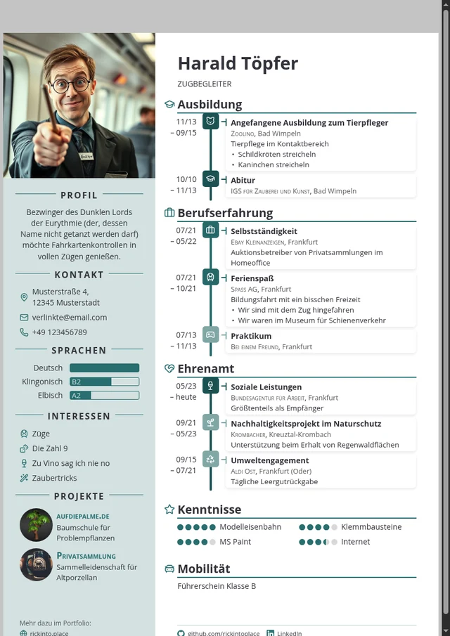
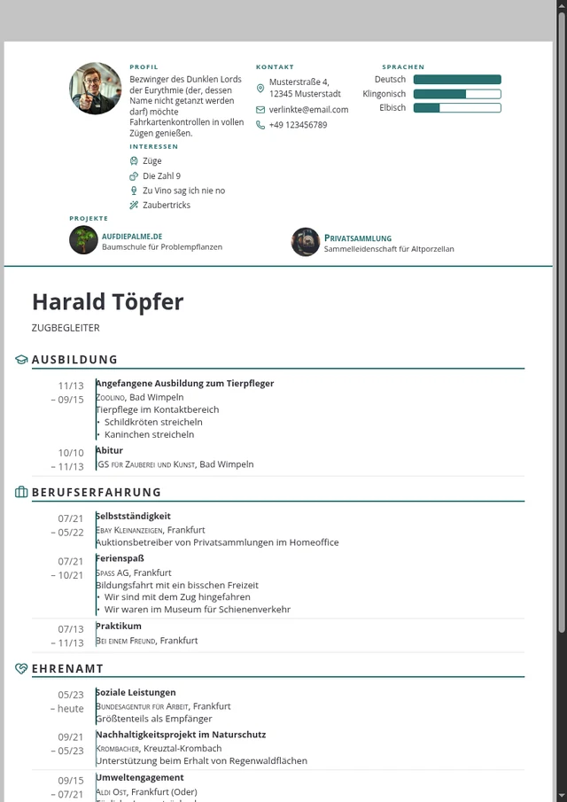
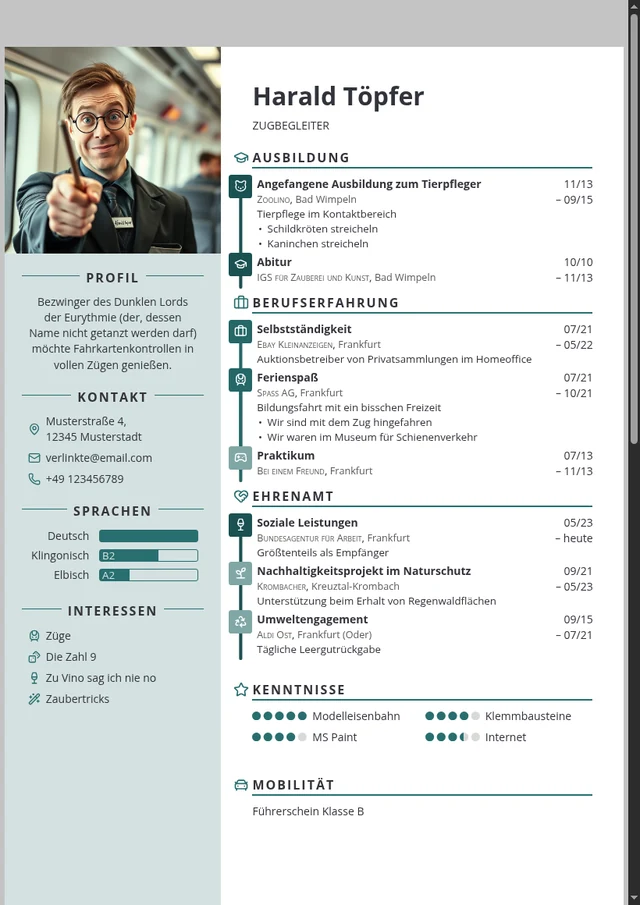
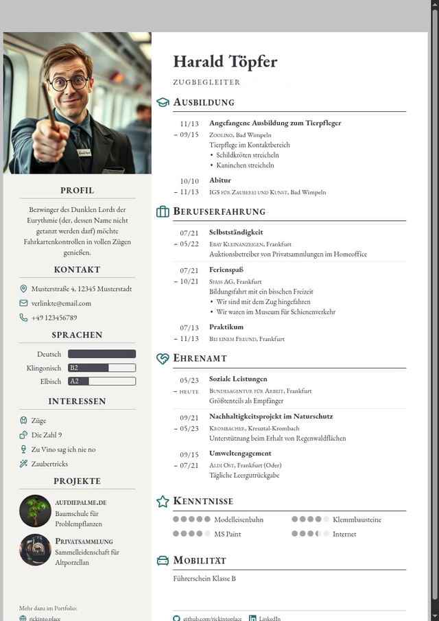
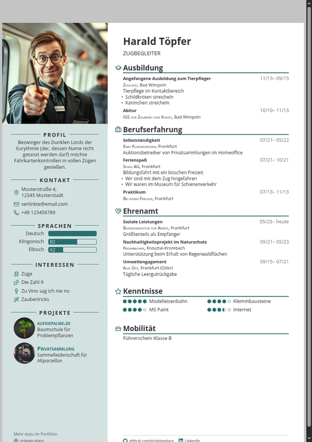
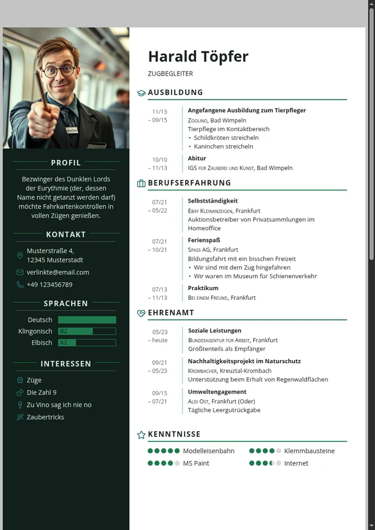

# Themes

Jedes Theme ist eine einzelne CSS-Datei. Wie man eine schreibt, steht in
[CONTRACT.md](CONTRACT.md) – und am bequemsten geht es in der **Werkstatt**
im Baukasten selbst: Themes → Werkstatt, tippen, zusehen, Datei herunterladen.

Die Bilder hier erzeugt `python3 tools/make-theme-previews.py`.

## Clean

Ruhige Grundform: Zeitleiste links am Rand, Datum rechts, kein Schnickschnack. Das Ausgangslayout von RickCV. about-en: A calm baseline: timeline along the edge, dates on the right, nothing else. RickCV's original layout.

`themes/clean.css`

## Dynaline

Die Zeitleiste wird zur Achse: Stationen sitzen auf einer durchgehenden Linie, die Dauer bestimmt ihren Abstand. about-en: The timeline becomes the axis: stations sit on one continuous line, and how long they lasted sets their distance.

`themes/dynaline.css`

## Einspaltig

Kopfblock mit Foto, Profil und Kontakt, darunter der Werdegang über die volle Breite – als schlichte Liste ohne Zeitleiste, Punkte und Kästen. Dieselbe Reihenfolge für Mensch und Maschine. Der Kopfblock trägt alle Blöcke der Seitenspalte – wer viele davon eingeschaltet hat, stellt auf mehrseitig um. about-en: A header block with photo, profile and contact, the career below across the full width – a plain list without timeline, dots or boxes. The same order for a person and for a machine. The header carries every sidebar block, so with many of them switched on, turn on multi-page.

`themes/einspaltig.css`

## Icons

Symbole tragen das Layout: jede Station bekommt ihren Punkt, die Zeitleiste laeuft mittig. about-en: Symbols carry the layout: every station gets its dot, the timeline runs down the middle.

`themes/icons.css`

## Klassisch

Serifen, Kapitälchen, Haarlinien. Kein Punkt, kein Kasten, keine Farbfläche – die Stationen stehen als Liste mit hängendem Datum. Für Bewerbungen, bei denen Zurückhaltung die Botschaft

`themes/klassisch.css`

## Kompakt

Für lange Lebensläufe: das Datum steht in der Zeile des Titels statt daneben, Aufzählungen rücken enger, Ränder schrumpfen. Damit passt ein Werdegang auf ein Blatt, der sonst zwei braucht. about-en: For long careers: the date sits on the title's line instead of beside it, bullets move closer, margins shrink. A career that needs two sheets elsewhere fits on one.

`themes/kompakt.css`

## Terminal

Feste Schrittweite, kantige Kanten, dunkle Seitenspalte. Die Stationen stehen an einer Randlinie wie Code in einem Editor, mit einem Quadrat statt eines Punktes. about-en: Monospaced, square edges, a dark sidebar. Stations sit against a gutter rule like code in an editor, with a square instead of a dot.

`themes/terminal.css`
