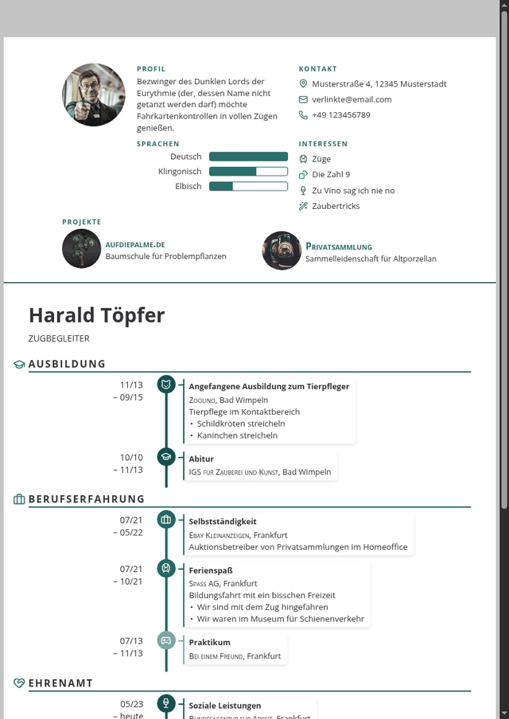
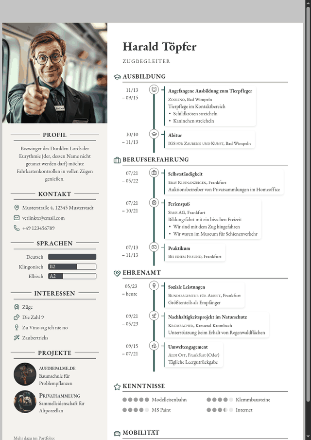
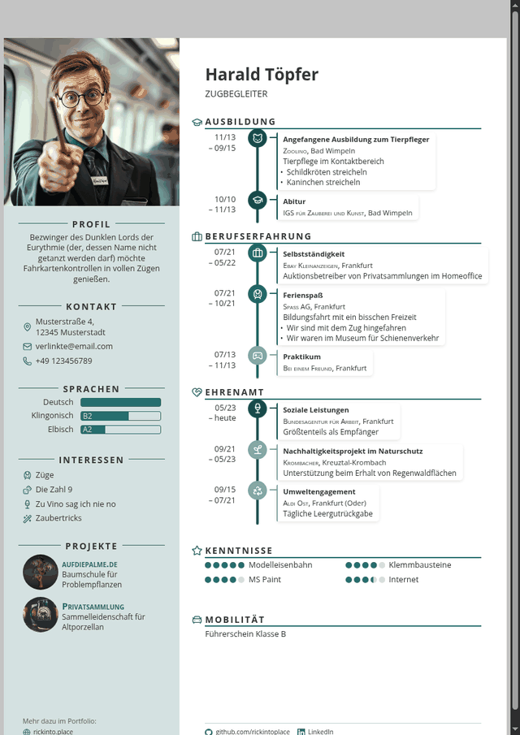
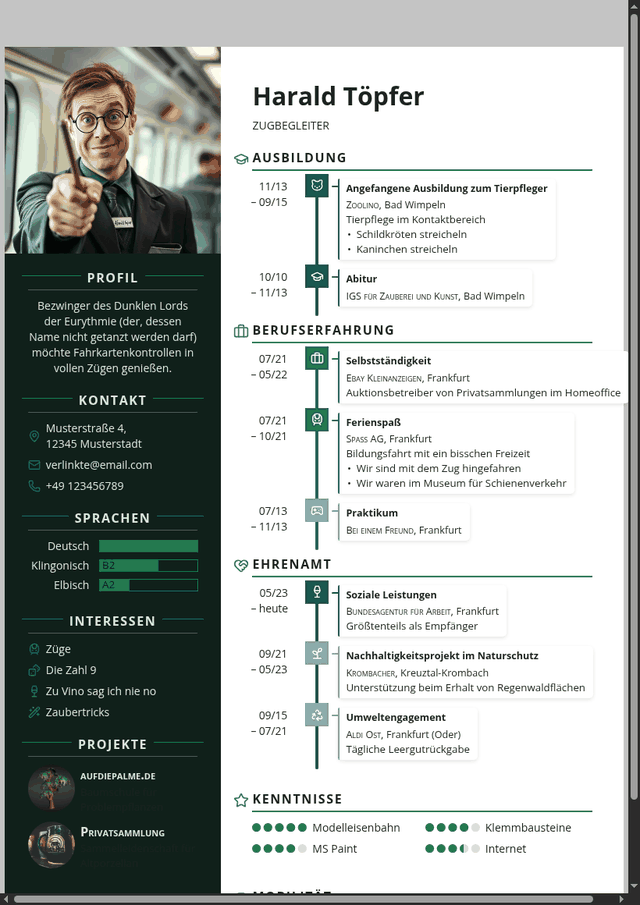

# Themes

Jedes Theme ist eine einzelne CSS-Datei. Wie man eine schreibt, steht in
[CONTRACT.md](CONTRACT.md) – und am bequemsten geht es in der **Werkstatt**
im Baukasten selbst: Themes → Werkstatt, tippen, zusehen, Datei herunterladen.

Die Bilder hier erzeugt `python3 tools/make-theme-previews.py`.

## Clean

Ruhige Grundform: Zeitleiste links am Rand, Datum rechts, kein Schnickschnack. Das Ausgangslayout von RickCV. about-en: A calm baseline: timeline along the edge, dates on the right, nothing else. RickCV's original layout.

`themes/clean.css`

## Dynaline

Die Zeitleiste wird zur Achse: Stationen sitzen auf einer durchgehenden Linie, die Dauer bestimmt ihren Abstand. about-en: The timeline becomes the axis: stations sit on one continuous line, and how long they lasted sets their distance.

`themes/dynaline.css`

## Einspaltig

Kopfblock mit Foto, Profil und Kontakt, darunter der Werdegang über die volle Breite. Eine Spalte liest sich für Mensch und Maschine in derselben Reihenfolge. about-en: A header block with photo, profile and contact, and the career below across the full width. One column reads the same way for a person and for a machine.

`themes/einspaltig.css`

## Icons

Symbole tragen das Layout: jede Station bekommt ihren Punkt, die Zeitleiste laeuft mittig. about-en: Symbols carry the layout: every station gets its dot, the timeline runs down the middle.

`themes/icons.css`

## Klassisch

Serifen, feine Linien, keine Flächen. Für Bewerbungen, bei denen Zurückhaltung die Botschaft ist – Behörden, Kanzleien, Banken. about-en: Serifs, thin rules, no filled areas. For applications where restraint is the message – public service, law, banking.

`themes/klassisch.css`

## Kompakt

Enger gesetzt, damit ein langer Werdegang auf ein Blatt passt: kleinere Schrift, weniger Luft, schmalere Ränder. about-en: Set tighter so a long career fits on one sheet: smaller type, less air, narrower margins.

`themes/kompakt.css`

## Terminal

Feste Schrittweite, kantige Kanten, grüner Akzent. Für Leute, die ihren Lebenslauf sowieso lieber in einem Editor hätten. about-en: Monospaced, square edges, a green accent. For people who would rather have written their resume in an editor anyway.

`themes/terminal.css`
