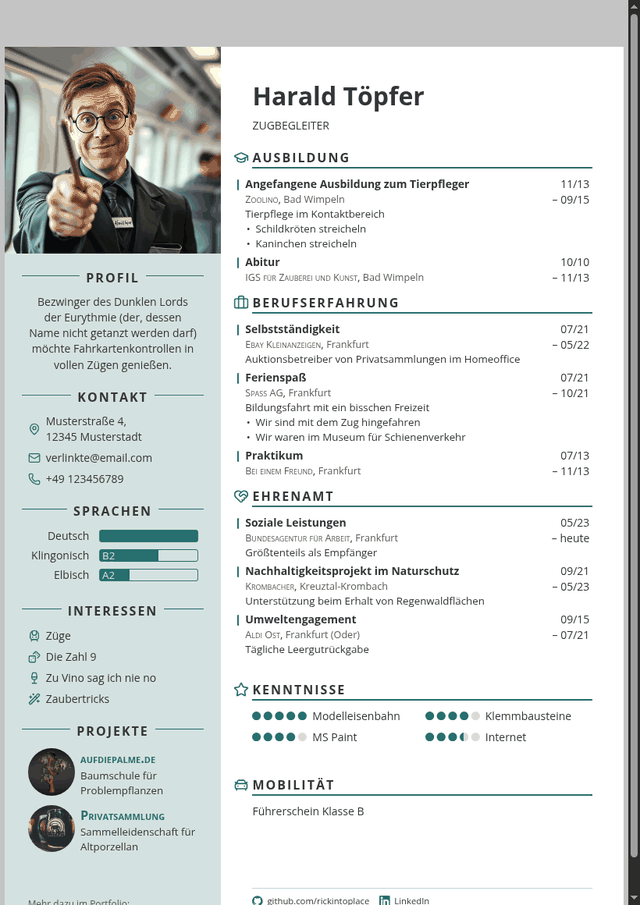
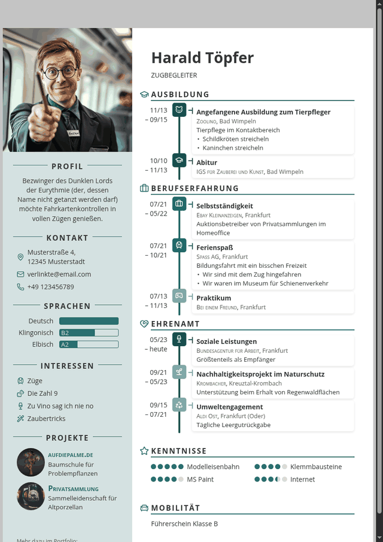
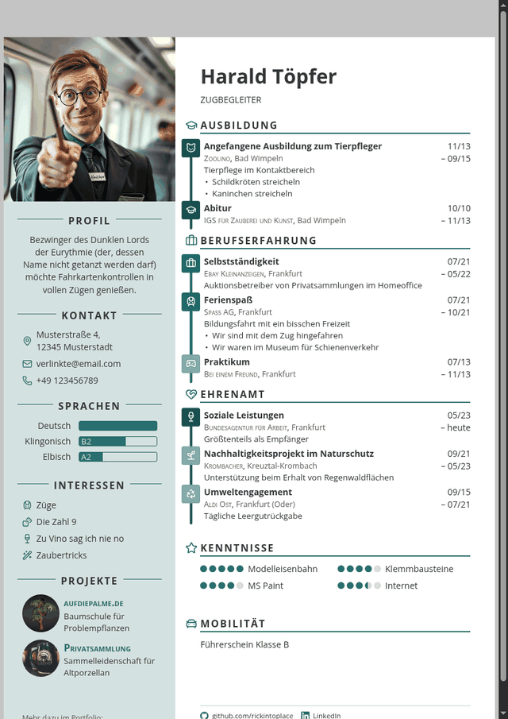

# Themes

Jedes Theme ist eine einzelne CSS-Datei. Wie man eine schreibt, steht in
[CONTRACT.md](CONTRACT.md) – und am bequemsten geht es in der **Werkstatt**
im Baukasten selbst: Themes → Werkstatt, tippen, zusehen, Datei herunterladen.

Die Bilder hier erzeugt `python3 tools/make-theme-previews.py`.

## Clean

Ruhige Grundform: Zeitleiste links am Rand, Datum rechts, kein Schnickschnack. Das Ausgangslayout von RickCV.

`themes/clean.css`

## Dynaline

Die Zeitleiste wird zur Achse: Stationen sitzen auf einer durchgehenden Linie, die Dauer bestimmt ihren Abstand.

`themes/dynaline.css`

## Icons

Symbole tragen das Layout: jede Station bekommt ihren Punkt, die Zeitleiste laeuft mittig.

`themes/icons.css`
